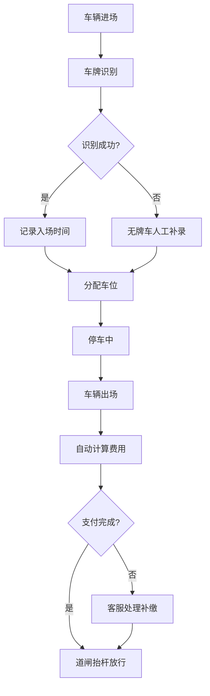

## 1. 产品概述

智慧停车 Web 应用是面向园区停车运营人员的综合管理平台，提供车位管理、收费运营、异常处理和数据分析等一站式功能。系统解决传统停车管理效率低、数据分散、异常响应慢等痛点，助力园区实现智能化、精细化停车运营。

- 目标用户：园区停车运营管理员、客服人员
- 核心价值：提升车位利用率、降低运营成本、优化车主服务体验

## 2. 核心功能

### 2.1 用户角色

| 角色 | 注册方式 | 核心权限 |
|------|---------|---------|
| 管理员 | 系统分配 | 车场配置、数据统计、报表导出、全功能管理 |
| 客服人员 | 系统分配 | 订单处理、退款补缴、备注跟进、异常处理 |

### 2.2 功能模块

1. **车场总览**：车位实时状态、今日收入、异常预警、设备状态
2. **车位地图**：可视化车位地图、车位状态筛选、车牌搜索定位
3. **订单中心**：入出场记录查询、临停计费、退款补缴、优惠券发放、订单备注
4. **月卡管理**：月卡开通、续费、黑白名单设置、无牌车补录
5. **异常处理**：设备离线提示、异常订单改派、无牌车记录处理
6. **统计报表**：收入按日汇总、车位利用率、导出对账

### 2.3 页面详情

| 页面名称 | 模块名称 | 功能描述 |
|---------|---------|-----------|
| 车场总览 | 数据概览卡片 | 车位总数/空闲/占用/预约、今日收入、今日车流量、异常订单数 |
| 车场总览 | 实时趋势图 | 24小时车位占用率趋势、7日收入趋势 |
| 车场总览 | 设备状态列表 | 道闸、摄像头状态监控、离线告警 |
| 车场总览 | 快速筛选 | 按车场、楼栋、时段筛选数据 |
| 车位地图 | 楼层切换 | 多层车场楼层切换导航 |
| 车位地图 | 车位状态着色 | 绿色空闲、蓝色已占用、黄色预约、红色异常 |
| 车位地图 | 车牌搜索 | 输入车牌快速定位车辆停放位置 |
| 车位地图 | 车位详情弹窗 | 车牌号、入场时间、停车时长、预计费用 |
| 订单中心 | 订单列表 | 车牌、入场时间、出场时间、费用、状态、操作 |
| 订单中心 | 筛选查询 | 按车场、楼栋、时段、订单状态、支付方式筛选 |
| 订单中心 | 订单操作 | 退款、补缴、添加备注、发放优惠券 |
| 月卡管理 | 月卡列表 | 车主信息、车牌、卡类型、有效期、状态 |
| 月卡管理 | 开通续费 | 新办月卡、到期续费、支持多种月卡套餐 |
| 月卡管理 | 黑白名单 | 白名单车辆优先进场、黑名单车辆限制入场 |
| 月卡管理 | 无牌车补录 | 手动录入无牌车信息、关联车主手机号 |
| 异常处理 | 异常列表 | 异常类型、车牌、时间、处理状态、改派操作 |
| 异常处理 | 设备告警 | 离线设备列表、一键重启提示、通知运维 |
| 异常处理 | 异常改派 | 将异常单分配给指定人员处理 |
| 统计报表 | 收入汇总 | 按日/周/月展示收入趋势、支持图表切换 |
| 统计报表 | 车位统计 | 车位利用率、高峰时段分析 |
| 统计报表 | 导出对账 | 支持 Excel 导出、自定义时间范围 |

## 3. 核心流程

### 3.1 临停车辆出入场流程
车辆进场 → 车牌识别 → 系统记录入场时间 → 车位指示灯变化 → 车辆出场 → 自动计费 → 支付完成 → 道闸抬杆

### 3.2 月卡用户续费流程
登录系统 → 进入月卡管理 → 搜索目标车辆 → 选择续费套餐 → 确认支付 → 更新有效期

### 3.3 异常订单处理流程
异常工单生成 → 客服人员认领 → 核实情况 → 执行退款/补缴/备注 → 标记完成

## 4. 用户界面设计

### 4.1 设计风格

- 主色调：深蓝色 `#1e3a5f`（专业稳重），辅助色：青色 `#00b4d8`（科技感），警示色：橙红 `#f77f00` / 红色 `#d62828`
- 按钮风格：圆角 6px，主按钮实心填充，次要按钮描边样式
- 字体：中文使用「思源黑体」，英文使用「Roboto Mono」等宽字体显示车牌和金额
- 布局风格：顶部导航 + 侧边菜单 + 内容区卡片式布局
- 图标风格：线性简约图标，使用 Lucide React 图标库

### 4.2 页面设计概览

| 页面名称 | 模块名称 | UI 元素 |
|---------|---------|---------|
| 车场总览 | 数据概览卡片 | 大号数字、渐变背景、趋势小箭头、悬停放大效果 |
| 车位地图 | 车位网格 | 彩色色块网格、hover 显示详情、定位动画闪烁 |
| 订单中心 | 数据表格 | 斑马纹行、状态标签色、行内操作按钮、分页器 |
| 统计报表 | 图表区域 | ECharts 折线/柱状图、渐变填充、数据点动画 |

### 4.3 响应式设计

- 桌面优先设计（1440px 基准）
- 侧边栏在 1024px 以下可折叠收起
- 表格在移动端转换为卡片式列表
- 触控操作优化：按钮最小尺寸 44px

