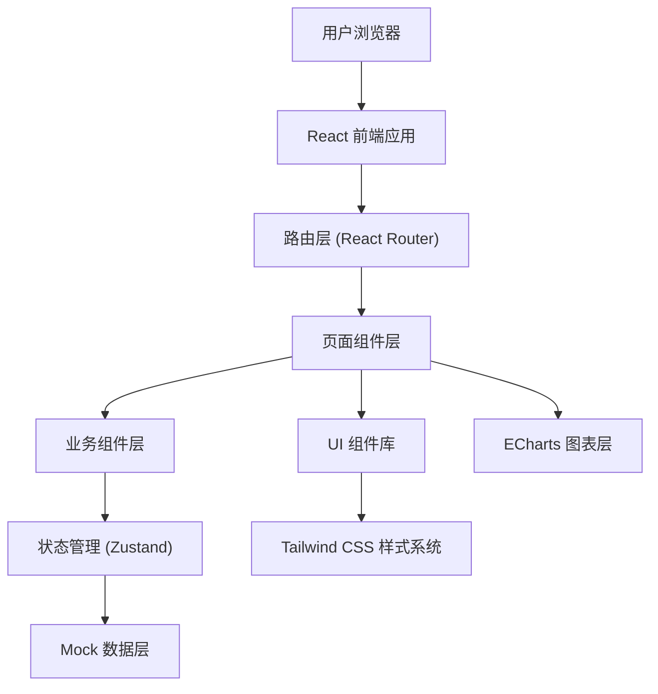
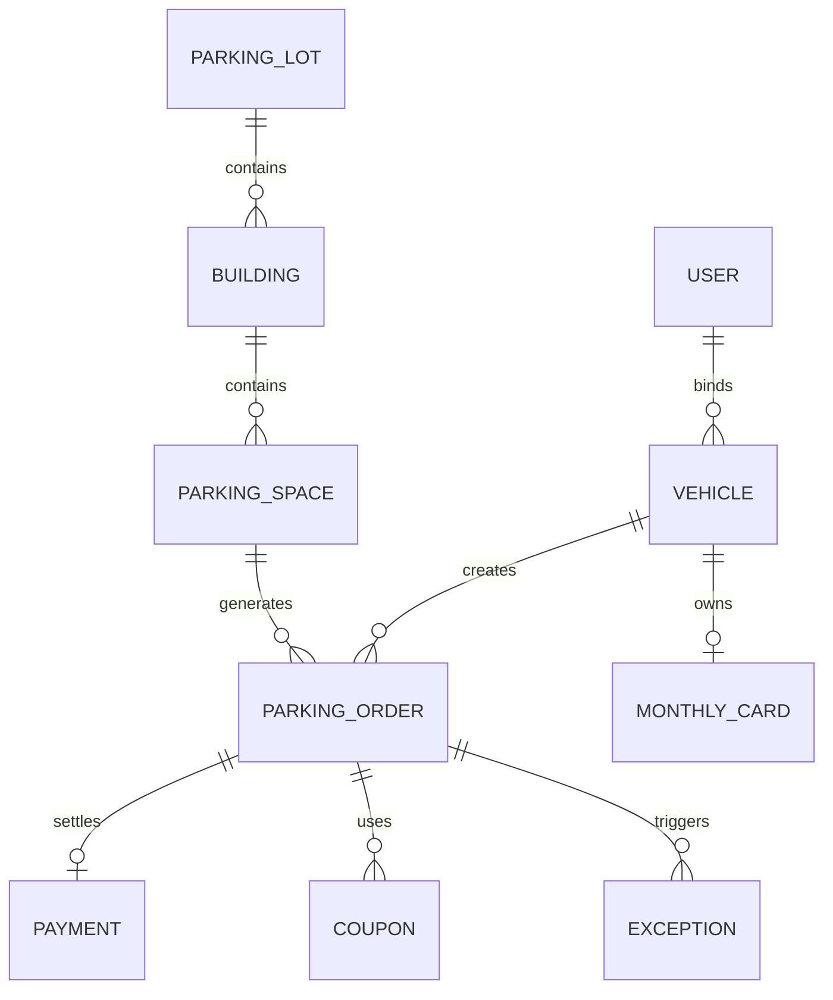

## 1. 架构设计



## 2. 技术栈说明

- **前端框架**：React 18 + TypeScript
- **构建工具**：Vite 5
- **路由**：React Router v6
- **样式方案**：Tailwind CSS 3
- **状态管理**：Zustand（轻量级状态管理）
- **UI 组件**：自定义组件 + Lucide React 图标库
- **图表库**：ECharts 5 + echarts-for-react
- **数据层**：Mock 数据（内置 JSON 数据模拟后端接口）
- **日期处理**：dayjs
- **代码规范**：ESLint + Prettier

## 3. 路由定义

| 路由路径 | 页面组件 | 用途说明 |
|---------|---------|---------|
| `/dashboard` | Dashboard | 车场总览页 |
| `/parking-map` | ParkingMap | 车位地图页 |
| `/orders` | Orders | 订单中心页 |
| `/monthly-cards` | MonthlyCards | 月卡管理页 |
| `/exceptions` | Exceptions | 异常处理页 |
| `/reports` | Reports | 统计报表页 |
| `*` | Dashboard | 默认重定向至总览页 |

## 4. 数据模型

### 4.1 核心数据实体



### 4.2 TypeScript 类型定义

```typescript
// 车位
interface ParkingSpace {
  id: string;
  spaceNo: string;
  floor: number;
  buildingId: string;
  status: 'available' | 'occupied' | 'reserved' | 'maintenance';
  plateNumber?: string;
  enterTime?: string;
}

// 停车订单
interface ParkingOrder {
  id: string;
  plateNumber: string;
  spaceNo: string;
  enterTime: string;
  exitTime?: string;
  duration: number; // 分钟
  totalFee: number;
  paidFee: number;
  status: 'parking' | 'pending' | 'paid' | 'refunded' | 'exception';
  paymentMethod?: 'wechat' | 'alipay' | 'cash' | 'monthly';
  couponId?: string;
  remark?: string;
}

// 月卡
interface MonthlyCard {
  id: string;
  plateNumber: string;
  ownerName: string;
  phone: string;
  cardType: 'monthly' | 'quarterly' | 'yearly';
  startTime: string;
  endTime: string;
  status: 'active' | 'expired' | 'suspended';
  listType?: 'whitelist' | 'blacklist' | 'normal';
}

// 异常单
interface ExceptionOrder {
  id: string;
  orderId?: string;
  type: 'unrecognized_plate' | 'device_offline' | 'payment_failed' | 'manual_override';
  plateNumber?: string;
  description: string;
  createTime: string;
  assignee?: string;
  status: 'pending' | 'processing' | 'resolved';
}

// 收入统计
interface RevenueSummary {
  date: string;
  totalRevenue: number;
  tempRevenue: number;
  monthlyRevenue: number;
  orderCount: number;
  avgDuration: number;
}
```

## 5. 目录结构

```
src/
├── components/          # 通用 UI 组件
│   ├── Layout/         # 布局组件（侧边栏、顶栏）
│   ├── Card/           # 数据卡片
│   ├── Table/          # 数据表格
│   ├── Modal/          # 弹窗
│   ├── StatusTag/      # 状态标签
│   └── FilterBar/      # 筛选栏
├── pages/              # 页面组件
│   ├── Dashboard/
│   ├── ParkingMap/
│   ├── Orders/
│   ├── MonthlyCards/
│   ├── Exceptions/
│   └── Reports/
├── store/              # Zustand 状态管理
│   ├── parking.ts
│   ├── orders.ts
│   └── user.ts
├── mock/               # Mock 数据
│   ├── parking.ts
│   ├── orders.ts
│   └── statistics.ts
├── types/              # TypeScript 类型定义
│   └── index.ts
├── utils/              # 工具函数
│   ├── format.ts
│   └── fee.ts
├── styles/             # 全局样式
│   └── index.css
├── App.tsx
└── main.tsx
```

## 6. 开发规范

- 组件命名：PascalCase（ParkingCard, OrderTable）
- 变量/函数：camelCase（plateNumber, formatFee）
- 常量：UPPER_SNAKE_CASE（PARKING_STATUS, FEE_RATE）
- 所有页面需支持响应式布局
- 颜色统一使用 CSS 变量管理
- 时间格式化统一使用 dayjs

